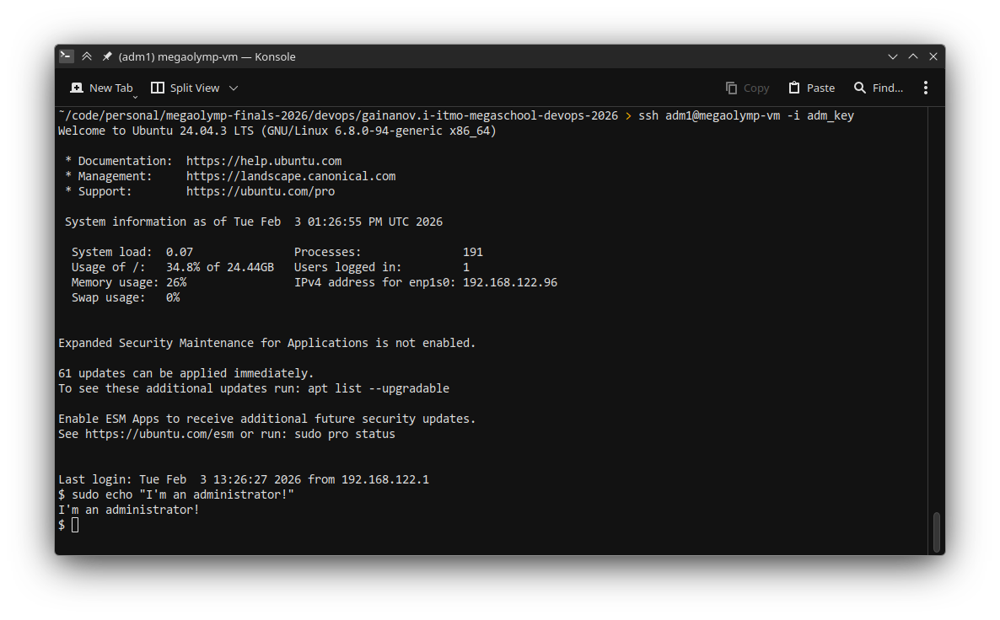
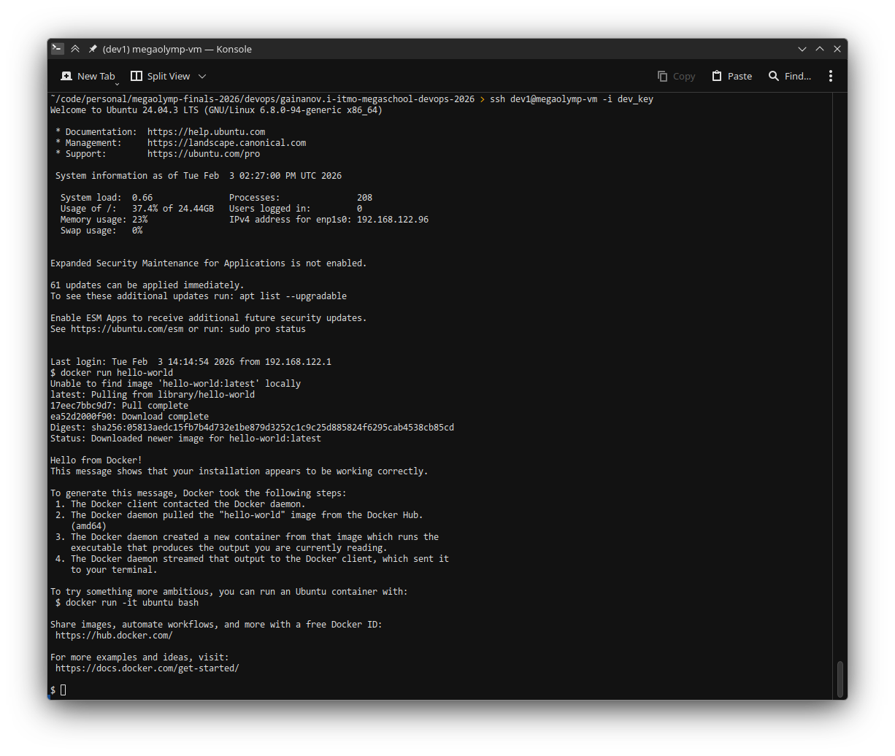

# Автоматизация подготовки сервера

## Инструкция по запуску

Для обоих вариантов необходимо на контрол ноде:

1. С помощью команды `ssh-keygen` сгененерировать SSH-ключи для доступа к пользователям `dev1` и `adm1`. Сгенерированные **ПУБЛИЧНЫЕ** ключи необходимо будет поместить по путям `pubkeys/adm1_key.pub` и `pubkeys/dev1_key.pub` соответственно.

2. При необходимости использования своих зеркал Docker необходимо настроить их в `docker/daemon.json`. По умолчанию используются зеркала от Google.

3. Установить коллекции для телеметрии:
```bash
ansible-galaxy collection install community.general
ansible-galaxy collection install grafana.grafana
```

4. Установить docker-compose на хост, который будет собирать телеметрию. 

   В папке `telemetry` находятся `docker-compose.yml` для сервисов телеметрии. Запустить сервисы телеметрии на хосте для телеметрии с использованием `docker compose up -d`.

### Запуск на хосте (target nodes == control node)

1. Установить Ansible на хосте.

2. Исполнить команду: 

```bash
ansible-playbook -K megaolymp-playbook.yml
```

### Запуск на удаленном сервере (target nodes != control node)

1. Установить Ansible на хосте и целевой ноде.

2. Добавить в файл `hosts.ini` список хостов, на которых будет выполняться автоматизация подготовки.

3. Исполнить команду: 

```bash
ansible-playbook -i hosts.ini -K megaolymp-playbook.yml
````

## Выполняемые действия

Согласно ТЗ принимается за правду утверждение, что все хосты работают под Ubuntu Server. Была включена поддержка ACL в файловой системе.

### Контроль доступа пользователей

Были созданы группы `developers` и `admins` в соответствии с ТЗ штатными средствами Ansible.

Были созданы пользователи `dev1` и `adm1` с доступом по SSH-ключу.

#### Проверка работоспособности:

1. `sudo` от пользователя из группы admins без пароля



### Контейнеризация

Была восоздана [инструкция с официального сайта Docker](https://docs.docker.com/engine/install/ubuntu/) средствами Ansible для минимизации количества "подводных камней".

В качестве прокси-хранилища образов докеров используется Google Container Registry, реализована возможность настроить эти параметры путем редактирования `docker/daemon.json` на контрол-ноде.

#### Проверка работоспособности

2. Использование Docker без sudo от пользователя из группы developers.



### Мониторинг

